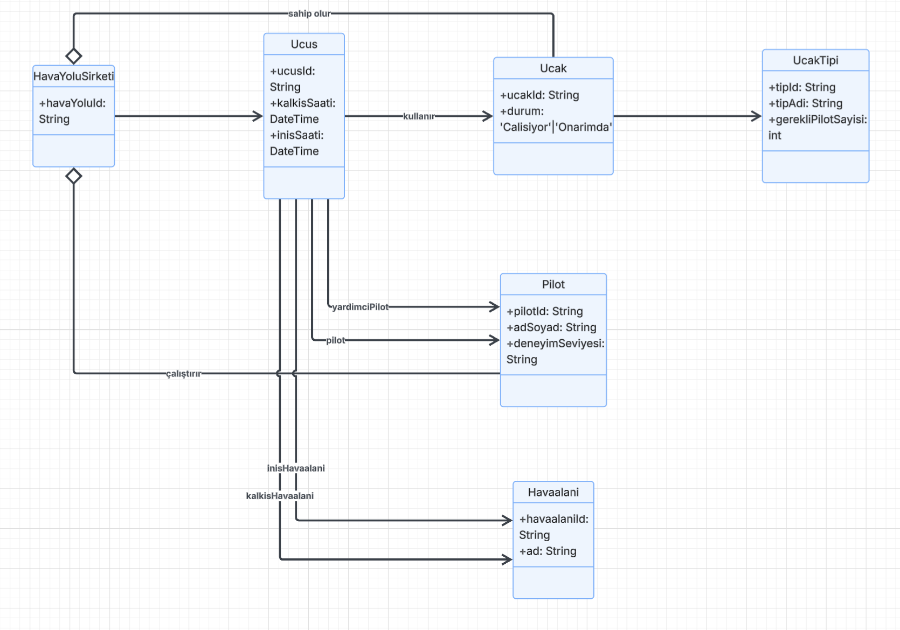

# Uçuş Yönetim Sistemi Sınıf Diyagramı (UML)

## Ödev İsterleri

Bir havayolu şirketinin uçuşlarını takip etmek için bir sistem tasarlanması istenmektedir. Genel isterler şunlardır:

1. Sistemde birden fazla havayolu şirketi bulunabilir ve uçuşlar belirli bir havayolu şirketi tarafından düzenlenir.
2. Her uçuşun kalkış ve varış havaalanı bilgileri ile kalkış ve varış zamanı vardır.
3. Her uçuş bir uçak ile gerçekleştirilir. Uçakların modeli, tipi ve yolcu kapasitesi gibi bilgileri vardır.
4. Uçuşlarda görevli pilot(lar) bulunur. Pilotların isimleri ve deneyim yılı gibi bilgileri vardır.

---

## UML Sınıf Diyagramı

