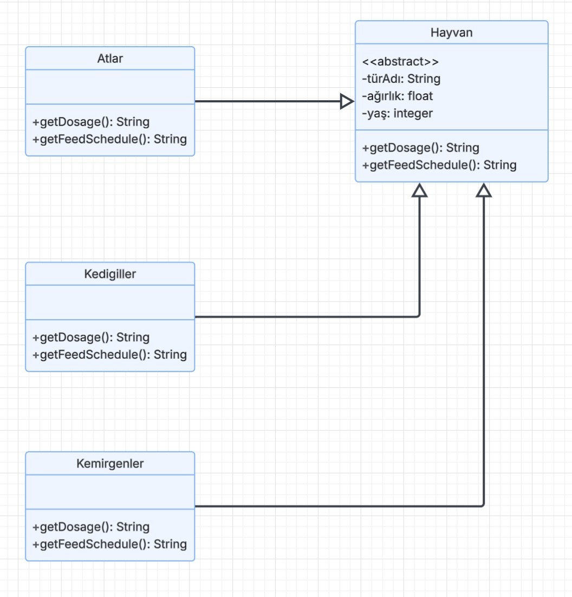

# Hayvanat Bahçesi Yönetim Sistemi Sınıf Diyagramı (UML)

## Ödev İsterleri

Bir hayvanat bahçesindeki hayvanlar hakkındaki bilgileri takip etmek için bir sistem tasarlanması istenmektedir:

1. Hayvanlar: Atlar (atlar, zebralar, eşekler vb.), Kedigiller (kaplanlar, aslanlar vb.), Kemirgenler (sıçanlar, kunduzlar vb.) gibi gruplara ayrılır.
2. Hayvanların depolanan genel bilgileri tüm gruplar için aynıdır (tür adı, ağırlık, yaş vb.).
3. Sistem her hayvan için belirli ilaçların dozajını hesaplayabilmelidir (`getDosage()`).
4. Sistem yem verme zamanlarını hesaplayabilmelidir (`getFeedSchedule()`).

---

## UML Sınıf Diyagramı

