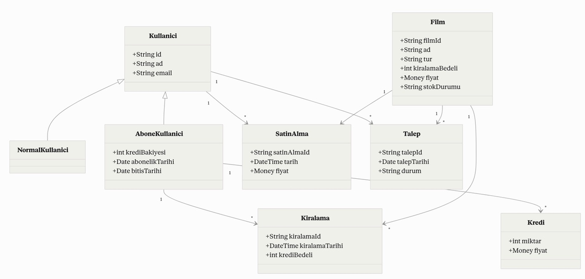

# Asansör Simülasyonu Sınıf Diyagramı (UML)

## Ödev İsterleri

Kodluyoruz Sigorta Şirketi 12 katlı bir ofis binası inşa etmek ve onu en son asansör teknolojisi ile donatmak istiyor. Binanın asansörlerinin işlemlerini modelleyen bir yazılım simülatörü oluşturulması istenmektedir.

**Sistem Bileşenleri ve Gereksinimler:**
- **Bina:** 12 katlıdır ve 5 asansör barındırır.
- **Asansör (Elevator):** Her biri 6 yetişkin yolcu kapasiteli. Özellikleri: Kendi kapısı, kat gösterge ışığı, kontrol paneli (hedef düğmeleri, kapı açma/kapama, acil durum sinyal düğmesi). Sadece gerektiğinde hareket eder.
- **Kat (Floor):** Her katta 5 asansör boşluğu için kapı, her kapı için yön gösteren sinyal ışığı ve varış zili bulunur. Katlarda ayrıca üç set asansör çağrı düğmesi (yukarı/aşağı) vardır.
- **Programlayıcı (Scheduler/Dispatcher):** Yolcuların çağrı düğmesine basmasıyla en uygun asansörü o kata görevlendirir.
- **İşleyiş:** 
  - Çağrı alan asansör yönlenir.
  - İçerideki gösterge ışığı katları gösterir.
  - Varışta dış gösterge lambası yanar, kat zili çalar.
  - Kapılar önceden belirlenmiş bir süre otomatik açılır.
- **Simülatör Motoru:** Gerçek zamanı simüle etmek, zaman damgası koymak ve günlüğe kaydetmek için bir "saat" (Clock) kullanır. Yolcuları ve hedef katlarını belirlemek için rastgele sayı üreteci (Random Number Generator) kullanır.

*(Bu tasarımda Encapsulation, Inheritance, Polymorphism ve Abstraction gibi OOP prensipleri gözetilmiştir.)*

---

## UML Sınıf Diyagramı

